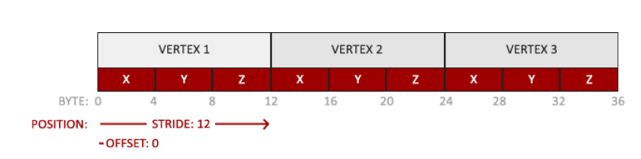
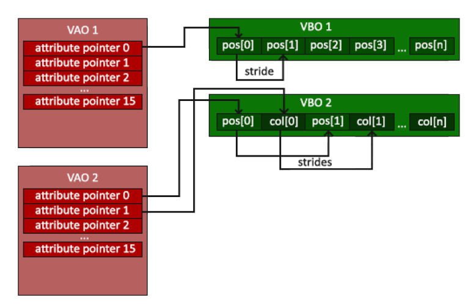

# How things are rendered

 Everything in OPENGL is in a 3D space, so to show it on our screen it goes through an entire graphics pipeline.

To understand the pipeline better we can divide it into two parts:

- Transforming 3D coordinates to 2D
- Transforming 2D coordinates into colored pixels

By passing in 3D coordinates into the pipeline will give us a colored image on the screen

## Components

There are 6 components in the graphics pipeline

1. Vertex Shader
2. Shape Assembly
3. Geometry Shader
4. Rasterization
5. Fragment Shader
6. Tests and Blending

The pipeline takes an input of vertex data, which is simply a list of 3D coordinates which form a shape. This list can also contain more information regarding the coordinates like the color.

**Note:** OpenGL also requires something called a primitive. These are hints we give OpenGL which tells it what type of render type is required. These hints can be something like `GL_POINTS`, for a list of points, or `GL_TRIANGLES`, for triangles, and so on.

### Vertex Shader

Takes a single vertex as input. It then transforms that 3D coordinate into different 3D coordinates, the shader also alows us to do some basic processing on teh vertex attributes.

### Shape Assembly or Primitive Assembly

It takes input all the 'processed' vertices from the vertex shader and assemble them into a primative.

**Note**: The primative was hinted on beforehand to openGL

### Geometry Shader

After getting input from the previous stage, the geometry shader has the ability to generate other shapes by emitting new vertices to form new primitives.

### Rasterization

In this stage the resulting primitive(s) are mapped to corresponding pixels on the screen. Also **clipping** (discarding all pixels that are outside the users view) may be performed during this stage which will increase overall performance.

**Note:** OpenGL uses a keyword called **fragment** which is just the data of a single pixel.

### Fragment Shader

This simply calculates the final color of each pixel. This stage contains effects such as lights, shadows, color and so on.

### Test and Blending

After the previous stage we have a final object. This phase properly places the object in the scene. It may put it in front of another object or change its opacity, its depth and so on. And because of these changes the previously set colors of the pixels change.

**Note:** OpenGL requires use to create vertex and fragment shaders. There are no defaults for them.

## OpenGL Code

**Note:** Assuming window has already been created

We start of by specifying some memory on the GPU and adding some data to it (Data in this case will be the vertex data). The reason we do this is because we want openGL to use that data in the buffer to draw us shapes on the screen.

**Note:** The reason we pass data to our GPU is that CPU to GPU data transfer is slow and openGL will be using the GPU, so to keep the entire process fast we from the start pass on the data to the GPU before openGL starts rendering shapes on the screen.

``` c++
// glGenBuffers() returns a bufferID to our buffer variable
// this bufferID will be that of the memory specified on the GPU
unsigned int VBO;
glGenBuffers(1, &VBO);
```

Once our buffer is created, we select and store data on it.

``` c++
// this is the data we want to store in the buffer (in this case coordinates of a triangle)
// vertex (x coordinate, y coordinate, z coordinate)
float vertex_data[] = {
    -0.5f, -0.5f, 0.0f,
     0.5f, -0.5f, 0.0f,
     0.0f,  0.5f, 0.0f
}
// glBindBuffer() will actually select our buffer to start working on
// openGL will only work on the buffer we have selected
// It will take in two parameters
// firstly, what type of data the buffer will hold (in this case a simple array)
// and the actual buffer
glBindBuffer(GL_ARRAY_BUFFER, VBO);
// glBufferData will actually store the data inside the array
// the first parameter will be the type of data (int this case a simple array)
// the second will be size of the data, this will be used to specify the size of our buffer
// the third will be our data itself
// the last will be the usage type, this is only a hint to openGL regarding the usage of this data
// so even if we give it an incorrect usage type, it will work but will be slower
// it has two parts, frequency of access and nature of access
// frequency of access just reffers to how many times the data will be modified and used
// this has 3 types:
//     - STREAM: Data is modified once and used few times
//     - STATIC: Data is modified once and used many times
//     - DYNAMIC: Data is modified repeatedly and used many times
// nature of access means what the data is used for
// this also has 3 types:
//     - DRAW: used as source for GL drawing
//     - READ: Not important for now
//     - COPY: Not important for now
// in this case we will be using GL_STATIC_DRAW
glBufferData(GL_ARRAY_BUFFER, sizeof(vertex_data), vertex_data, GL_STATIC_DRAW)
```

We have to tell openGL what the layout of the buffer actually is. As mentioned before the buffer itself can store more information about our shape than only its coordinate such as its color etc. These things are called vertex attributes. Another thing would be that how would openGL know if the position themselves are 2D or 3D. We need to explicitly inform openGL about all this. In other words openGL needs to know how many bytes there are for each attribute. Before getting in the code itself lets look at how the vertex buffer looks in the GPU. This is also called a VBO (vertex buffer object).



As we have only stored positions in our buffer we need to only specify position's information to openGL. We can see 4 things from the diagram:

1) Single coordinate takes up 4 bytes of floating point values.
2) Position consists of 3 of these 4 byte values.
3) There is no space inbetween each value. X is next to Y and Y is next to Z. So they are tightly packed.
4) The first value in our buffer starts at location 0.

Using this knowledge we use openGL's attribute function to set all this up.

**Note:** If we had more than one attribute like color, texture etc we would call this function for each attribute

``` c++
// glVertexAttribPointer() is used to set it up
// the first parameter takes in what attribute we want to set up by telling its index
// in this case its position and we know its at location 0
// the second is specifying how many components this attribute has
// in this case 3 (x, y, z)
// the third is the type of data (in this case GL_FLOAT)
// the fourth asks if we want to normalize the data (in this case we don't so GL_FALSE)
// the fifth asks the number of bytes till the next value
// so in this case the size of a single vertex which is made of 3 float data
// the last is the pointer to where position data begins in buffer
// in this case its 0, but openGL requires it to be a void * so we cast it
glVertexAttribPointer(0, 3, GL_FLOAT, GL_FALSE, 3 * sizeof(float), (void*)0);
// once it is set up we need to call another function to enable it
// we pass on the index of the attribute we want to enable
glEnableVertexAttribArray(0);
```

Before going on to programming shaders, we need to bound a vertex array object (VAO). VAO stores pointers to each attribute of our vertex buffer object (VBO). This array will make it faster for switching between attributes. OpenGL also requires that we use a VAO and a VBO. The diagram is below.



``` c++
// the function below will create a VAO and store its ID in the variable we provide it
unsigned int VAO;
glGenVertexArrays(1, &VAO);

// just like we binded our VBO we'll have to bind our VAO
glBindVertexArray(VAO);

//  ..... VBO code HERE ......
```

The next step is programming the vertex shader. This is what runs on the GPU. This tells the GPU what to do with the data we have provided it (via the buffer). We need to tell the GPU how it needs to draw the triangle. It has the vertex data in its buffer all we need to do is tell it what to do with the data we have provided it. This is done by providing openGL the vertex positions we want each vertex to be on. Also we might want to provide some transformations if we want our vertces to change. The shader needs to be written in GLSL which has the same syntax as c++. After writing the shader we compile it.

**Note:** The vertex shader runs for each vertex. In this case for 3 vertices.

``` GLSL
// code for vertex shader

//version specifies the openGL version
#version 330 core
// declaring all input vertex attributes using the 'in' keyword
// we already set the attribute at location 0 so we tell GLSL that
// as we know we have 3D coordinates we'll store it in vec3 and give it a variable name
layout(location = 0) in vec3 aPos;

void main() {
    // gl_Postion is the what the vertex shader will output
    // so if we want to change the position of our vertices
    // we simply change them and assign them to gl_Postion
    // but in this case we don't so we pass the same positions
    // gl_Postion is a vec4 so we need to cast our vec3 to vec4
    gl_Position = vec4(aPos.x, aPos.y, aPos.z, 1.0);
}
```

To actually complile it, we either need to read it in from another file or store the code inside a string. In this case we will store it in a string. OpenGL requires it to be in const char* format so we won't use std::string.

``` c++
const char *vertexShaderSource =
    "#version 330 core\n"
    "layout(location = 0) in vec3 aPos;\n"
    "void main() {\n"
    "    gl_Postion = vec4(aPos.x, aPos.y, aPos.z, 1.0);\n"
    "}\n";
```

After that we assign we compile and set this code to a shader

``` c++
// we first create an actual shader using glCreateShader()
// this takes in the type of shader
// and returns an id for that specific shader
unsigned int vertexShader;
vertexShader = glCreateShader(GL_VERTEX_SHADER);

// to attach the source code we use glShaderSource()
// this will take 4 parameters
// first is the id of the shader
// second is the amount of strings we are passing in this case 1
// third is the actual source code
// the fourth we don't need for now so NULL
glShaderSource(vertexShader, 1, &vertexShaderSource, NULL);
// then to compile we pass on the id to glCompileShader()
glCompileShader(vertexShader);

```

Its good practice to check for compilation errors when compiling shaders.

``` c++
int result;
// glGetShaderiv() is used to get any information from our compiler
// it could be its status or the actual compile error msg and many more
// now we get the status and store it in result
glGetShaderiv(vertexShader, GL_COMPILE_STATUS, &result);
if (result == GL_FALSE) {
    // to actually get the error msg first we need the length of the error msg so we may store it in a char array
    // we'll use the same glGetShaderiv() method and query it for GL_INFO_LOG_LENGTH
    int length;
    glGetShaderiv(vertexShader, GL_INFO_LOG_LENGTH, &length);
    // once we have the length we can create an array of that length to store the actual msg
    // and then use glGetShaderInfoLog to get the msg
    // it takes in  4 parameters
    // first will be the id of the shader
    // second will the length of our msg buffer
    // third will be the length of the error msg
    // fourth will be the msg buffer itself
    char* msg = new char[length];
    glGetShaderInfoLog(vertexShader, length, &length, msg);

    std::cout << "Compilation Error in Shader" << std::endl;
    std::cout << "Error: " << msg << std::endl;

    // lastly we have to delete the shader itself because the source code itself is incorrect
    glDeleteShader(vertexShader);
}
```

After compiling vertex shader we move onto fragment shader. Whose purpose is more regarding the color, effects shadows etc.

**Note:** The fragment shader runs for each pixel that exists in that shape, so if the triangle consists of 2300 pixels so the fragment shader will be called 2300 times.

``` GLSL
// code for fragment shader
#version 330 core
// fragment shader requires one output variable (vec4) that has the final color
// output variables are defined using out
out vec4 FragColor;

void main() {
    // we simply create a vec4 with its rgb values
    FragColor = vec4(1.0f, 0.5f, 0.2f, 1.0f);
}
```

The compilation process is the exact same as vertex shader the only differece being when we use glCreateShader() we pass in GL_FRAGMENT_SHADER. I will not write it below as its the same.

Once both shaders are compiled we need to create a shader program to link together mulitple shaders.

``` c++
// to create a shader program we use glCreateProgram() which will give us an id for that program
unsigned int shaderProgram;
shaderProgram = glCreateProgram();

// to attach the shader we use glAttachShader() which takes in the shaderprogram id and shader id
glAttachShader(shaderProgram, vertexShader);
glAttachShader(shaderProgram, fragmentShader);
// now we link them together
glLinkProgram(shaderProgram);
// and lastly we activate it
glUseProgram(shaderProgram);

// once we've activated it we can now delete the shaders
glDeleteShader(vertexShader);
glDeleteShader(fragmentShader);
```

Finally we issue a draw call for our selected buffer and our shader. This also includes the previously mentioned primitive that we hint openGL.

``` c++
// glDrawArrays() will use the binded buffer and draw it
// the first parameter will be the hint we need to give openGL (in this case GL_TRIANGLES will be the hint)
// the next will be at which index of the buffered array should openGL start to render
// in this case we want to render all the vertices so we enter 0
// lastly will specify the count of vertices
// this will be called inside our render loop
glDrawArrays(GL_TRIANGLES, 0, 3);
```

If we wanted to draw a square than we would draw two triangles together. We'd add 3 more vertices in our array and in our draw call specify that we want to draw 6 vertices not 3.

``` c++
float vertices[] = {
    // first triangle
    -0.5f, -0.5f, 0.0f,
     0.5f, -0.5f, 0.0f,
     0.5f,  0.5f, 0.0f,

    // second triangle
     0.5f,  0.5f, 0.0f,
    -0.5f,  0.5f, 0.0f,
    -0.5f, -0.5f, 0.0f
};

// inside render loop
// changing draw call
glDrawArrays(GL_TRIANGLES, 0, 6);
```

This gives us a square, but it is wasting vertices. As a square should have 4 vertices this has 6. In smaller shapes its not a big performance drop but in real applications with huge models this can lead to lots of wasted resources. To fix this issue openGL provides us with Element Buffer Objects (EBO). What this allows us to do is only define unique vertices and defines another array called indices that will tell EBO what vertex to draw in what order. So in the case of the square we can tell the EBO which vertices to draw for each triangle.

``` c++
float vertices[] = {
    -0.5f, -0.5f, 0.0f, // vertex 0
     0.5f, -0.5f, 0.0f, // vertex 1
     0.5f,  0.5f, 0.0f, // vertex 2
    -0.5f,  0.5f, 0.0f  // vertex 3
};

unsigned int indices[] = {
    0, 1, 2, // triangle 1
    2, 3, 0  // triangle 2
};

// creating the EBO is very similar to the VBO
// the difference being we set the type as GL_ELEMENT_ARRAY_BUFFER
// and we pass in indices as its data
unsigned int EBO;
glGenBuffers(1, &EBO);
glBindBuffer(GL_ELEMENT_ARRAY_BUFFER, EBO);
glBufferData(GL_ELEMENT_ARRAY_BUFFER, sizeof(indices), indices, GL_STATIC_DRAW);

// we also change the draw call inside the render loop
// the first parameter will be the type of shape
// the second will the number of indices NOT vertex
// the third will be the type of indices which we set as unsigned ints
// the fourth will be the actual indices array but we already binded it before hand so no need to pass it
glDrawElements(GL_TRIANGLES, 6, GL_UNSIGNED_INT, nullptr);
```
