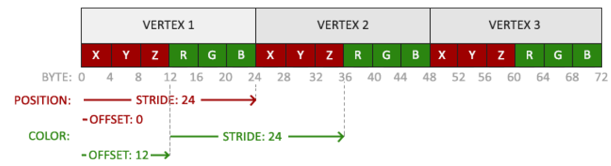
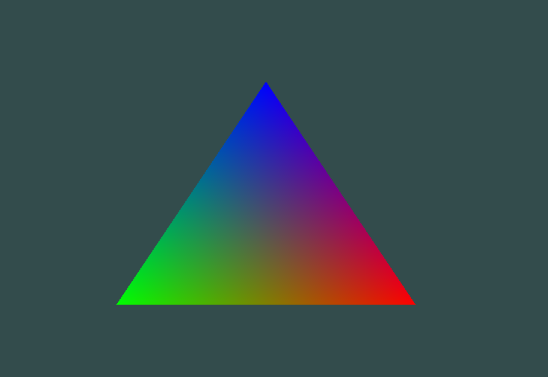

# More Attributes in Vertex Buffer

As mentioned before our vertex data can be more than just the positions of each vertex. It could also contain colors, texture coordinates, normals etc. In this case we'll create a triangle meaning 3 vertices but we'll also add color data to it as well. We'll first have to change the vertex data itself.

``` c++
float vertex_data[] = {
    // positions       // colors
     0.5f, -0.5f, 0.0f, 1.0f, 0.0f, 0.0f, // bottom right
    -0.5f, -0.5f, 0.0f, 0.0f, 1.0f, 0.0f, // bottom left
     0.0f,  0.5f, 0.0f, 0.0f, 0.0f, 1.0f  // top
};
```

**Note:** The vertex array and vertex buffer are made the same exact way as mentioned in `Triangle_Rendering.md`

The only other thing we need to do is set its layout. But before jumping into the code lets see the structure of the buffer itself.



Just a revision lets understand what the image actually means. Firstly we can see each vertex has 2 attributes, positions(x y z) and colors(r g b). That means we need to call `glVertexAttribPointer` twice for each attribute. The stride is the size (in bytes) we need to move ahead to reach the next vertex's same attribute's element. Meaning if we are on x-position of vertex1 how many bytes do we travel to reach vertex2's x-position. Stride will be the same for each element of each attribute. Calculation of the stride is simple we simply need to count the number of elements in the vertex, in this case 6, and multiply that with all their data types, in this case all are float. So 6 * 4 = 24 bytes. And just to check lets take the value of R of vertex1, its position is on byte 12 in our buffer and lets add 24 to it, 24 + 12 = 36 byte and we can see that vertex2's R is at position byte 36. The other important thing is the offset, this is simply the starting position of our attribute. We can see that the offset of our position attribute will be 0 as its always the first attribute of each vertex. And our color attribute is 12 bytes after our position attribute's offset. To simplify it we can say offset is the size of our previous attribute. Now this is all we need to set the layout of our buffer.

**Note:** Size of float is 4 bytes. But in c++ its easier to simply use `sizeof(data_type)` to get the size. i.e `sizeof(float)`.

**Note:** Just a reminder that we don't have to define the layout for every vertex. This layout will work with all other vertices.

``` c++
// the first parameter is the location of our attribute
// second is the number of elements in our attribute
// third is the type
// fourth is if we want it normalized
// fifth is the stride
// sixth is the offset

// layout for positions
glVertexAttribPointer(0, 3, GL_FLOAT, GL_FALSE, 6 * sizeof(float), (void*)0);
glEnableVertexAttribArray(0);
//layout for colors
glVertexAttribPointer(1, 3, GL_FLOAT, GL_FALSE, 6 * sizeof(float), (void*)(3 * sizeof(float)));
glEnableVertexAttribArray(1);
```

Lastly we need to let our fragment shader know the colors as its incharge to setting colors. If we think about it we know that our vertex shader has access to our vertex buffer so we need to somehow send the color data to fragment shader from our vertex shader. This is done using `in` and `out` in GLSL which was previous touched upon when we made the triangle. We use `in` for inputs and `out` for outputs. Both these shaders are stuctured in a way that all outputs of the vertex shader are inputs of the fragment shader. So to send data we simply need to create an output variable and pass in the data. Below is the vertex shader code.

``` GLSL
#version 330 core
layout(location = 0) in vec3 aPos;   // we stored position at location 0
layout(location = 1) in vec3 aColor; // we stored colors are location 1

out vec3 ourColor;

void main() {
    gl_Position = vec4(aPos, 1.0);
    ourColor = aColor;
}
```

Below is the fragment shader code.

``` GLSL
#version 330 core
out vec4 FragColor;

in vec3 ourColor;

void main() {
    FragColor = vec4(ourColor, 1.0);
}
```

Now after adding the rest of the code as before we get a triangle like this:



The reason why the triangle has this rainbow effect is because of fragment interpolation which we will discuss later. To get a plain colored triangle add the same color values for each vertex in our vertex_data array.

So this is how we can add more attributes to our vertices. We can also say that we sent data from our CPU to our shader via the vertex buffer. There is also another way of sending data called uniforms. Uniforms are not set inside our vertex buffer it is directly sent to the GPU for all shaders to use. First lets add the changes to our vertex shader and fragment shader. The vertex shader will no longer be getting colors from vertex buffer and it will longer be outputting those colors to our fragment shader. And will now get the colors from the uniforms not our vertex shader.

``` GLSL
# fragment Shader
# version 330 core
layout(location = 0) in vec3 aPos;   // we stored position at location 0

void main() {
    gl_Position = vec4(aPos, 1.0);
}
```

``` GLSL
# Fragment Shader
#version 330 core
out vec4 FragColor;

// we simply type uniform its datatype and the name
uniform vec4 ourColor;

void main() {
    FragColor = ourColor;
}
```

After declaring the uniform using GLSL, we can now get its location and feed it data from the CPU (our code).

``` c++
// this this done inside our render loop

// the first parameter will be the shader program we made which linked our vertexshader and fragmentshader
// the second will be the name of the uniform
// if we have no used the uniform anywhere in our fragment shader our GPU will delete it automatically, so make sure it is being used
// this will return the location of our uniform
int location = glGetUniformLocation(shaderProgram, "ourColor");
// its important to note that we can only pass on data after glUseProgram(shaderProgram)
glUseProgram(shaderProgram);
// this is used to set the data to our uniform
// the first parameter is the location
// 2-4 are the actaul data
glUniform4f(location, 0.0f, 1.0f, 0.0f, 1.0f);
```

**Note:** OpenGL has many different functions for uniforms the above is used for four floats there are others like `glUniform2f()` which is used for 3 floats. And many more you can check that in the documentation [link to documentation!](http://docs.gl).

We now end up with a fully green triangle on the screen.

These were the two ways of passing data from our CPU to GPU.
